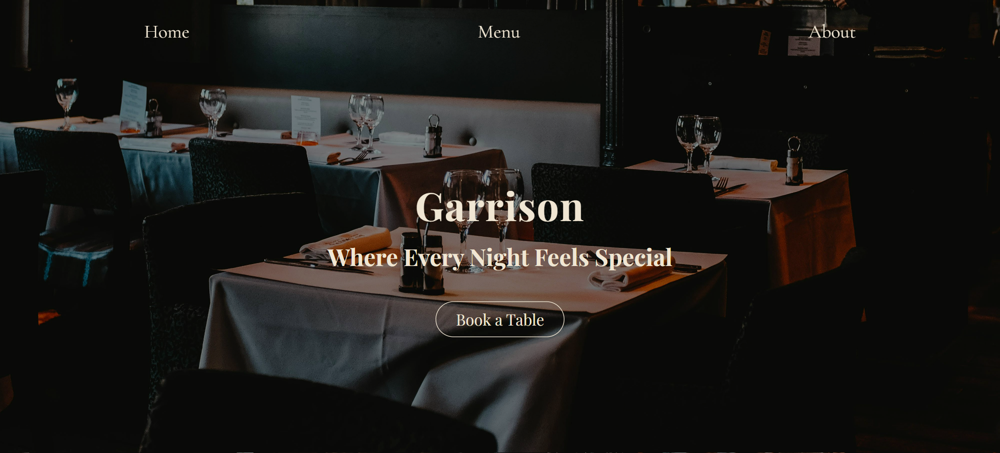
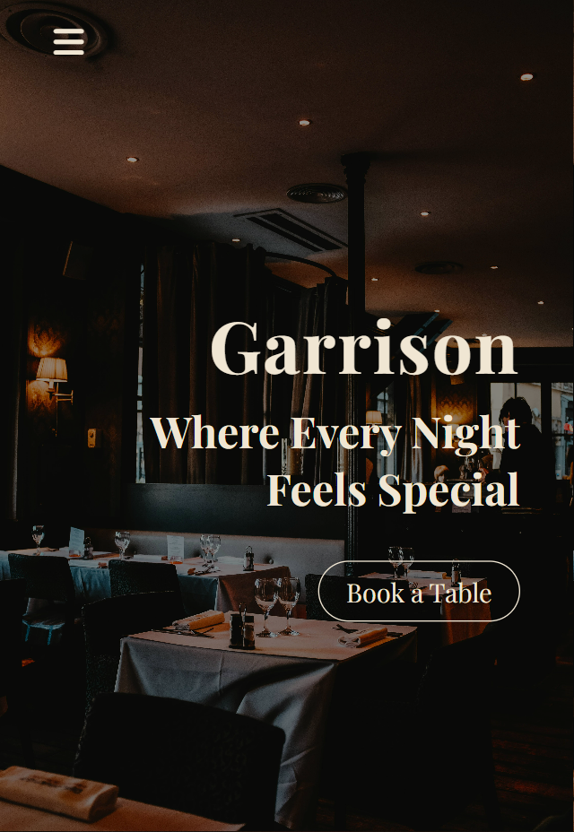

# 🍺 Garrison Bar & Restaurant

> A modern, responsive 3-page static website for Garrison Bar & Restaurant — built as a front-end development project using HTML, CSS, and JavaScript.



[](https://matthew1835.github.io/garrison-bar-n-restaurant/)
[](https://github.com/Matthew1835/garrison-bar-n-restaurant)

---

## 📋 Table of Contents

- [About](#about)
- [Pages](#pages)
- [Features](#features)
- [Tech Stack](#tech-stack)
- [Getting Started](#getting-started)
- [Screenshots](#screenshots)
- [What I Learned](#what-i-learned)
- [Contact](#contact)

---

## 📖 About

Garrison Bar & Restaurant is a fully responsive static website designed to showcase a modern dining and bar experience. The site presents the restaurant's brand, menu offerings, and story across three dedicated pages, with a focus on clean layout, smooth user experience, and mobile-friendliness.

This project was built as part of [The Odin Project](https://www.theodinproject.com/) curriculum to practise real-world front-end development skills.

---

## 📄 Pages

- **Home** — Hero section, call-to-action button, image gallery, and reservation form
- **Menus** — Food and drink menu listings
- **About** — The story and background of Garrison Bar & Restaurant

---

## ✨ Features

- Fully responsive design — works on mobile, tablet, and desktop
- Mobile hamburger navigation menu
- Image gallery section
- Call-to-action (CTA) button
- Reservation form (UI display)
- Clean, modern visual design
- Deployed live on GitHub Pages

---

## 🛠️ Tech Stack

- **HTML5** — Semantic page structure
- **CSS3** — Styling, layout (Flexbox/Grid), and responsive design
- **JavaScript** — Mobile hamburger menu toggle and interactivity
- **Webpack** — Module bundling
- **GitHub Pages** — Free static site hosting

---

## 🚀 Getting Started

### Prerequisites

- [Node.js](https://nodejs.org/) (v18 or higher)
- [Git](https://git-scm.com/)

### Installation

1. **Clone the repository**
   ```bash
   git clone https://github.com/Matthew1835/garrison-bar-n-restaurant.git
   cd garrison-bar-n-restaurant
   ```

2. **Install dependencies**
   ```bash
   npm install
   ```

3. **Run in development mode**
   ```bash
   npm run dev
   ```

4. **Build for production**
   ```bash
   npm run build
   ```

Or simply open the live site directly:
**[https://matthew1835.github.io/garrison-bar-n-restaurant/](https://matthew1835.github.io/garrison-bar-n-restaurant/)**

---

## 📸 Screenshots

| Home Page | Menu Page | About Page | Mobile View |
|-----------|-----------|------------|-------------|
|  |  |  |  |

---

## 🧠 What I Learned

- How to structure a multi-page website with consistent navigation and layout
- Building a responsive hamburger menu using vanilla JavaScript and CSS
- Using CSS Flexbox and Grid to create clean, adaptable layouts
- Setting up and configuring Webpack for a static front-end project
- Deploying a project to GitHub Pages from a Webpack build output

---

## 📬 Contact

**Myat Thuta (Matthew)**
- Portfolio: *https://matthew1835.github.io/my-portfolio/*
- LinkedIn: *https://www.linkedin.com/in/myat-thuta-26051a273/*
- Email: *myatthuta1835@gmail.com*
- GitHub: [@Matthew1835](https://github.com/Matthew1835)

---

## 📄 License

This project is open source and available under the [MIT License](LICENSE).

---

*⭐ If you liked this project, feel free to give it a star!*
